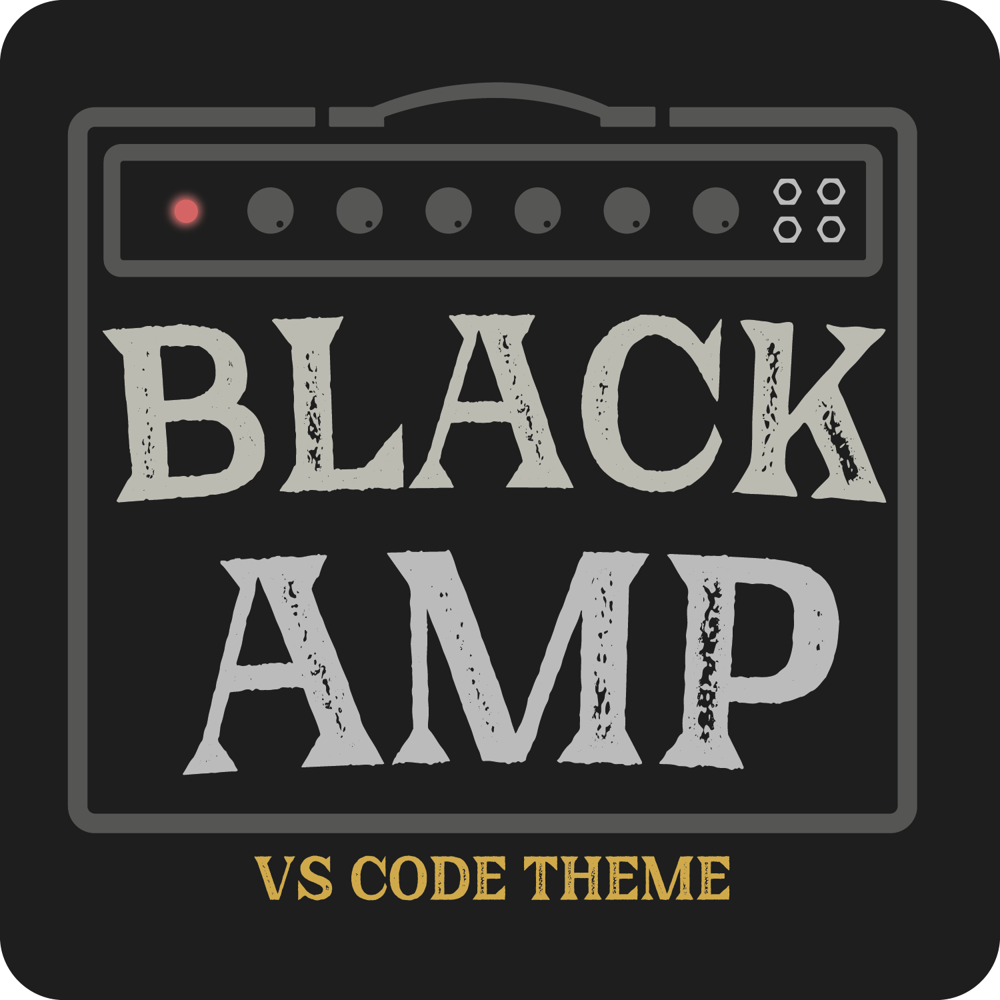
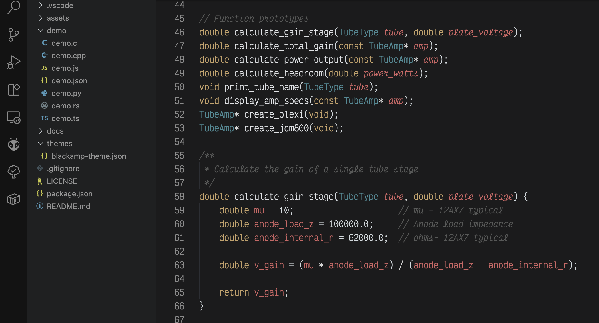

<div align="center">



_BLACKAMP is a dark VS Code theme inspired by loud vintage amplifiers._

[](https://marketplace.visualstudio.com/items?itemName=kt.blackamp)
[](./LICENSE)
[](https://code.visualstudio.com/)

</div>

## SCREENSHOTS

<div align="center">

<br></br>
<br></br>

</div>

## INSTALLATION

### VS Code Marketplace

1. Open **Extensions** (`Ctrl+Shift+X` / `Cmd+Shift+X`)
2. Search for **"Blackamp"**
3. Click **Install**
4. Select **"Blackamp"** from the theme dropdown

### Manual Installation

```bash
# Clone the repository
git clone https://github.com/kevinjterry/blackamp-theme.git

# Copy to VS Code extensions folder
# Windows: %USERPROFILE%\.vscode\extensions
# macOS: ~/.vscode/extensions
# Linux: ~/.vscode/extensions
```

### Quick Setup

```json
// settings.json
{
  "workbench.colorTheme": "blackamp",
  "editor.semanticHighlighting.enabled": true,
  "editor.fontFamily": "Fira Code",
  "editor.lineHeight": 1.5
}
```

## CONFIGURATION

### Recommended Settings

```json
{
  "editor.semanticHighlighting.enabled": true,
  "editor.bracketPairColorization.enabled": true,
  "editor.guides.bracketPairs": "active",
  "editor.fontLigatures": true,
  "workbench.tree.indent": 16,
  "terminal.integrated.fontFamily": "Fira Code"
}
```

## RECOMMENDED FONT

**Primary**: [Fira Code](https://github.com/tonsky/FiraCode) with ligatures

## CONTRIBUTING

Absolutely welcome contributions!

## LICENSE

MIT License - see [LICENSE](./LICENSE) for details.

## INSPIRATION

I built this originally off the base of [Safira](https://github.com/yinzdev/safira-vscode) which is a long running favorite theme of mine.
