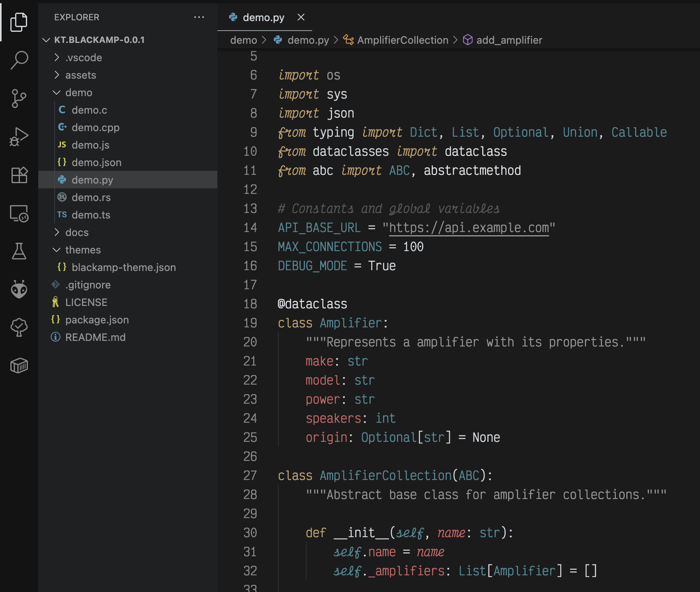

<div align="center">


_Blackamp is a dark VSCode theme inspired by loud vintage amplifiers_

[](https://marketplace.visualstudio.com/items?itemName=kt.blackamp)
[](./LICENSE)
[](https://code.visualstudio.com/)

</div>

---

## Screenshots

### C


_C syntax_

### Python



_Python syntax_

---

## Installation

### VS Code Marketplace

1. Open **Extensions** (`Ctrl+Shift+X` / `Cmd+Shift+X`)
2. Search for **"Blackamp"**
3. Click **Install**
4. Select **"Blackamp"** from the theme dropdown

### Manual Installation

```bash
# Clone the repository
git clone https://github.com/kevinjterry/blackamp-theme.git

# Copy to VS Code extensions folder
# Windows: %USERPROFILE%\.vscode\extensions
# macOS: ~/.vscode/extensions
# Linux: ~/.vscode/extensions
```

### Quick Setup

```json
// settings.json
{
  "workbench.colorTheme": "blackamp",
  "editor.semanticHighlighting.enabled": true,
  "editor.fontFamily": "Fira Code, Monaco, 'Courier New', monospace",
  "editor.fontSize": 14,
  "editor.lineHeight": 1.5
}
```

---

## Special Features

### **Constructor Highlighting**

```typescript
// Constructor calls are highlighted in signature orange
const color = new Color(255, 0, 0); // 🟠 Orange
const client = ApiClient.getInstance(); // 🟠 Orange
const vector = Vector3(1.0, 2.0, 3.0); // 🟠 Orange
```

### **Template String Magic**

```typescript
// Gold interpolation markers with proper nesting
const message = `Hello ${user.name}!`; // 🟡 Gold markers
const query = `SELECT * FROM ${table}`; // 🟡 Gold markers
```

### **Semantic Intelligence**

```python
# Smart highlighting based on context
def calculate_gain(self, voltage: float) -> float:
#   ^^^^^^^^^^^^^  ^^^^  ^^^^^^^  ^^^^^    ^^^^
#   Function       Self   Param    Type     Type
#   (blue-gray)   (teal) (gray)   (teal)   (teal)
```

---

## ⚙️ Configuration

### Recommended Settings

```json
{
  "editor.semanticHighlighting.enabled": true,
  "editor.bracketPairColorization.enabled": true,
  "editor.guides.bracketPairs": "active",
  "editor.fontLigatures": true,
  "workbench.tree.indent": 16,
  "terminal.integrated.fontFamily": "Fira Code"
}
```

## Recommended Font
**Primary**: [Fira Code](https://github.com/tonsky/FiraCode) with ligatures

## Contributing
We welcome contributions! Please see our [Contributing Guide](./CONTRIBUTING.md) for details.

## License
MIT License - see [LICENSE](./LICENSE) for details.

## Inspiration
Built from the base of Safira which is a long running favorite theme of mine.
